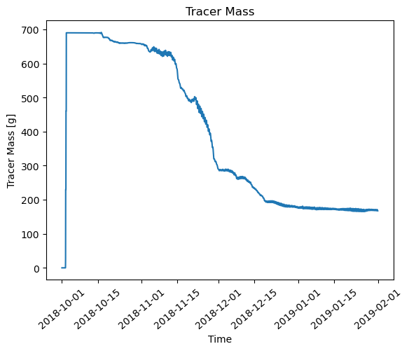
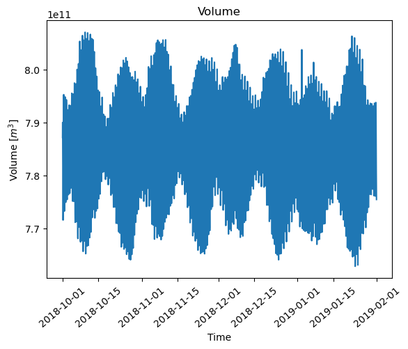
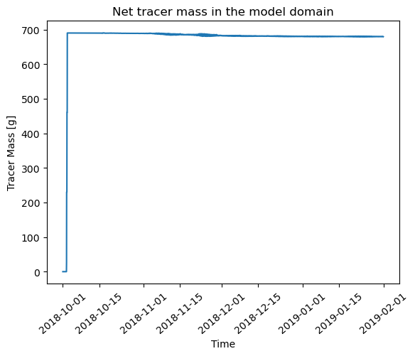
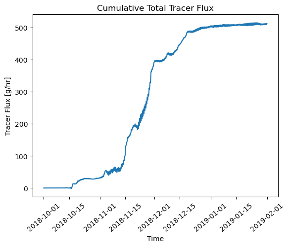
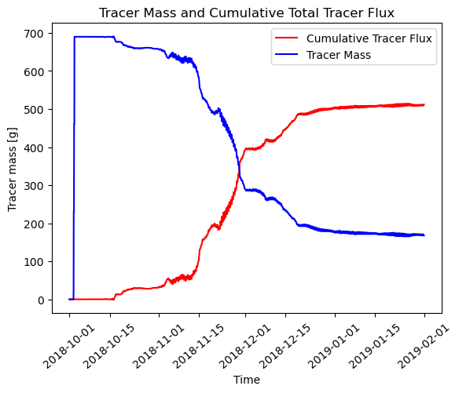
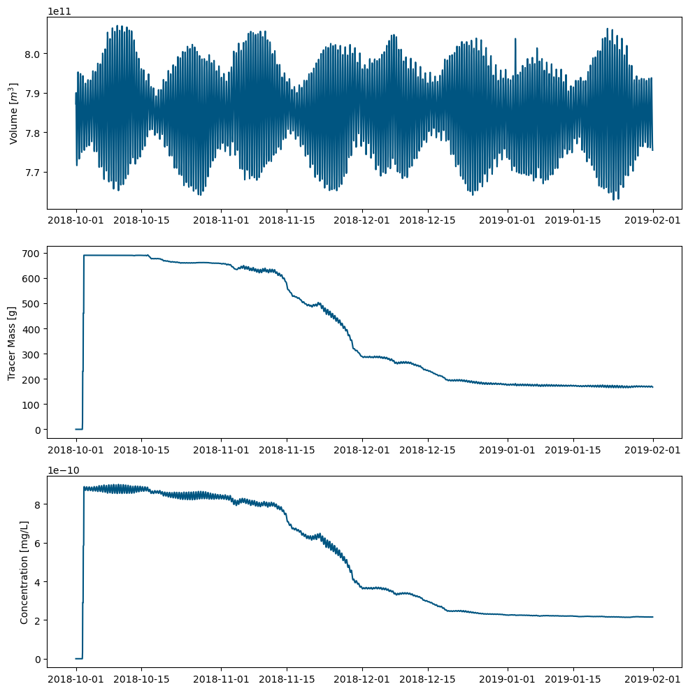
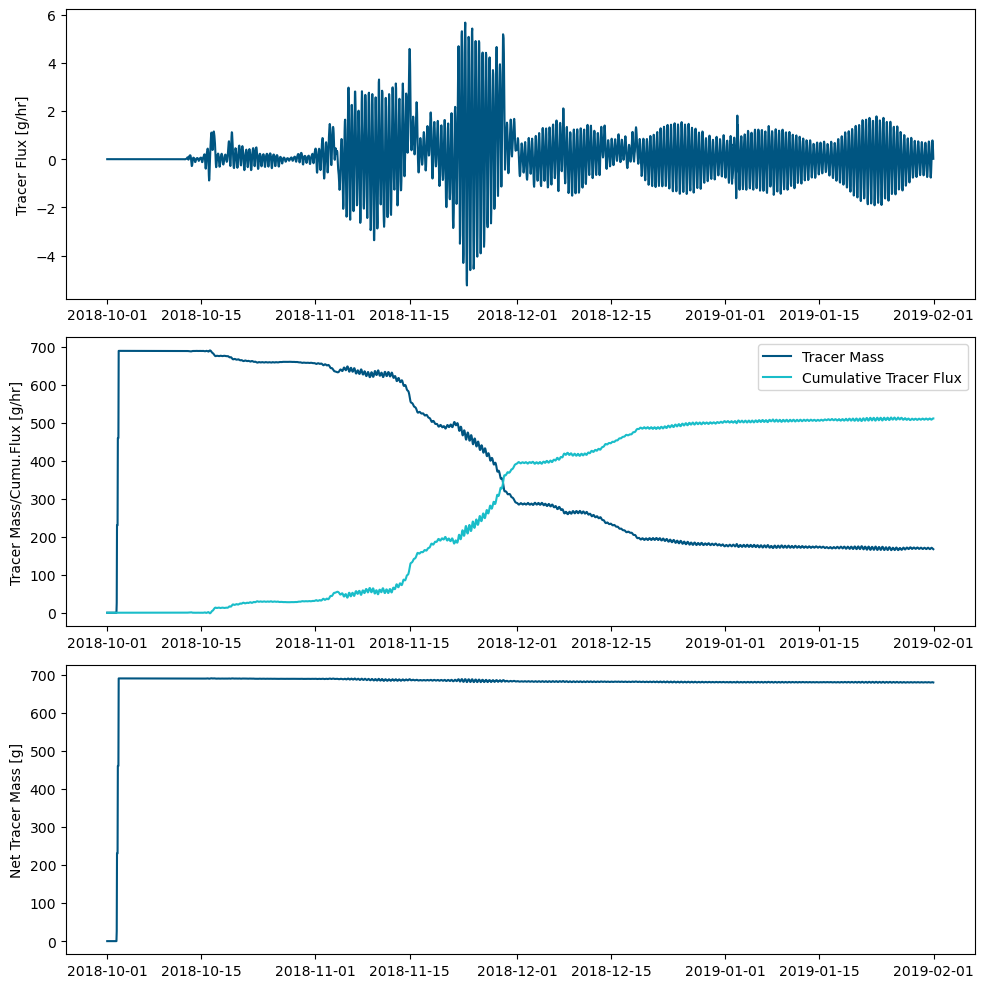
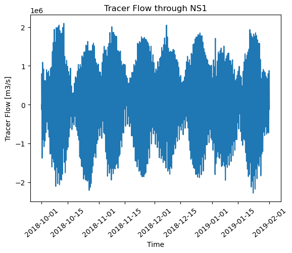
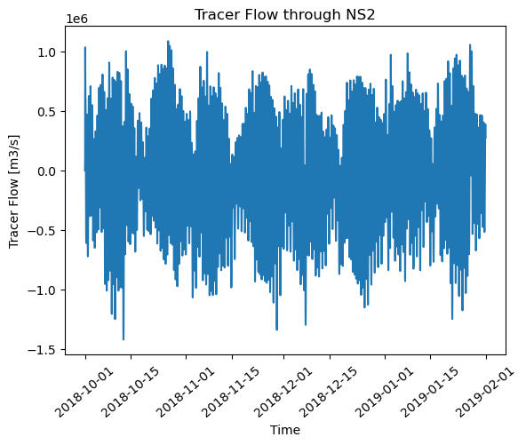
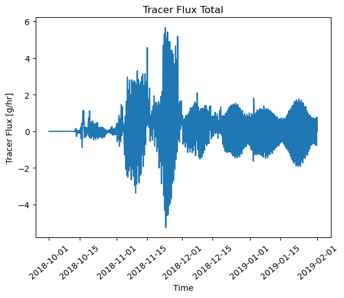

# Mass Balance Analysis
## Site A


```python
import matplotlib.pyplot as plt
import pandas as pd
import datetime as dt
```


```python
# read tuflowfv mass balance output csv
mass_bal = r'K:\scratchers\SiteA\high_res\mass_bal\mass_bal_dis_006n_002_MASS.csv'
df_mass = pd.read_csv(mass_bal, delimiter=',', usecols=['TIME', 'VOLUME [m^3]', 'TRACE_1_MASS [units]'])

# head of mass_bal dataframe
print(df_mass.head())
```

                      TIME  VOLUME [m^3]  TRACE_1_MASS [units]
    0  01/10/2018 00:00:00  7.871680e+11                   0.0
    1  01/10/2018 01:00:10  7.899846e+11                   0.0
    2  01/10/2018 02:00:08  7.845009e+11                   0.0
    3  01/10/2018 03:00:03  7.776127e+11                   0.0
    4  01/10/2018 04:00:14  7.729145e+11                   0.0
    


```python
df_mass['TRACE_1_MASS [g]'] = df_mass['TRACE_1_MASS [units]'] / 1000000
df_mass['TRACE_1_CONC'] = df_mass['TRACE_1_MASS [g]'] / df_mass['VOLUME [m^3]']
print(df_mass.head())
```

                      TIME  VOLUME [m^3]  TRACE_1_MASS [units]  TRACE_1_MASS [g]  \
    0  01/10/2018 00:00:00  7.871680e+11                   0.0               0.0   
    1  01/10/2018 01:00:10  7.899846e+11                   0.0               0.0   
    2  01/10/2018 02:00:08  7.845009e+11                   0.0               0.0   
    3  01/10/2018 03:00:03  7.776127e+11                   0.0               0.0   
    4  01/10/2018 04:00:14  7.729145e+11                   0.0               0.0   
    
       TRACE_1_CONC  
    0           0.0  
    1           0.0  
    2           0.0  
    3           0.0  
    4           0.0  
    


```python
# read tuflowfv flux output csv
flux= r'K:\scratchers\SiteA\high_res\mass_bal\mass_bal_dis_006n_002_FLUX.csv'
df_flux = pd.read_csv(flux, delimiter=',', usecols=['TIME', 'NS1_FLOW [m^3 s^-1]', 'NS2_FLOW [m^3 s^-1]', 'NS1_TRACE_1_FLUX [units m^3 s^-1]', 'NS2_TRACE_1_FLUX [units m^3 s^-1]'])
# head of flux dataframe
print(df_flux.head())
```

                      TIME  NS1_FLOW [m^3 s^-1]  \
    0  01/10/2018 00:00:00                  0.0   
    1  01/10/2018 01:00:10            -134333.7   
    2  01/10/2018 02:00:08             799288.8   
    3  01/10/2018 03:00:03             513126.3   
    4  01/10/2018 04:00:14             153102.7   
    
       NS1_TRACE_1_FLUX [units m^3 s^-1]  NS2_FLOW [m^3 s^-1]  \
    0                                0.0                 0.00   
    1                                0.0             94314.29   
    2                                0.0           1035166.00   
    3                                0.0            770842.90   
    4                                0.0            607895.00   
    
       NS2_TRACE_1_FLUX [units m^3 s^-1]  
    0                                0.0  
    1                                0.0  
    2                                0.0  
    3                                0.0  
    4                                0.0  
    


```python
#Add to fluxes at two nodestrings NS1 and NS2
df_flux['TRACE_1_Tot_Flux [units/s]'] = df_flux['NS1_TRACE_1_FLUX [units m^3 s^-1]'] + df_flux['NS2_TRACE_1_FLUX [units m^3 s^-1]']

#convert flux units from ng/L*m3/s to g/hr
df_flux['TRACE_1_Tot_Flux [g/hr]'] = df_flux['TRACE_1_Tot_Flux [units/s]'] / 1000000 *3600
df_flux['TRACE_1_Tot_Flux_cumu [g/hr]'] = df_flux['TRACE_1_Tot_Flux [g/hr]'].cumsum()
print(df_flux.head())

```

                      TIME  NS1_FLOW [m^3 s^-1]  \
    0  01/10/2018 00:00:00                  0.0   
    1  01/10/2018 01:00:10            -134333.7   
    2  01/10/2018 02:00:08             799288.8   
    3  01/10/2018 03:00:03             513126.3   
    4  01/10/2018 04:00:14             153102.7   
    
       NS1_TRACE_1_FLUX [units m^3 s^-1]  NS2_FLOW [m^3 s^-1]  \
    0                                0.0                 0.00   
    1                                0.0             94314.29   
    2                                0.0           1035166.00   
    3                                0.0            770842.90   
    4                                0.0            607895.00   
    
       NS2_TRACE_1_FLUX [units m^3 s^-1]  TRACE_1_Tot_Flux [units/s]  \
    0                                0.0                         0.0   
    1                                0.0                         0.0   
    2                                0.0                         0.0   
    3                                0.0                         0.0   
    4                                0.0                         0.0   
    
       TRACE_1_Tot_Flux [g/hr]  TRACE_1_Tot_Flux_cumu [g/hr]  
    0                      0.0                           0.0  
    1                      0.0                           0.0  
    2                      0.0                           0.0  
    3                      0.0                           0.0  
    4                      0.0                           0.0  
    

Slicing the mass df and the flux df


```python
#add start and end time to slice them easier
start_time = '01/10/2018 00:00:00'
end_time = '01/02/2019 00:00:00'

# Convert 'TIME' column to datetime format
df_mass['TIME'] = pd.to_datetime(df_mass['TIME'], dayfirst=True)
df_flux['TIME'] = pd.to_datetime(df_flux['TIME'], dayfirst=True)

# Convert start and end times to datetime format
start_time = pd.to_datetime(start_time, dayfirst=True)
end_time = pd.to_datetime(end_time, dayfirst=True)

# Slice the dataframe based on the start and end times
df_slicemass = df_mass[(df_mass['TIME'] >= start_time) & (df_mass['TIME'] <= end_time)]
df_sliceflux = df_flux[(df_flux['TIME'] >= start_time) & (df_flux['TIME'] <= end_time)]

#head rows
#print(df_slicemass.head())
#print(df_sliceflux.head())

```

Merge two data frames based on 'TIME'


```python
merged_df = pd.merge(df_slicemass, df_sliceflux, on='TIME')
#print(merged_df.head())

```


```python
#Add a new column for net mass
merged_df['TRACE_1_net_mass [g]'] = merged_df['TRACE_1_MASS [g]'] + merged_df['TRACE_1_Tot_Flux_cumu [g/hr]']
merged_df['TRACE_1_NET_CONC'] = merged_df['TRACE_1_net_mass [g]'] / merged_df['VOLUME [m^3]']
print(merged_df.head())
```

                     TIME  VOLUME [m^3]  TRACE_1_MASS [units]  TRACE_1_MASS [g]  \
    0 2018-10-01 00:00:00  7.871680e+11                   0.0               0.0   
    1 2018-10-01 01:00:10  7.899846e+11                   0.0               0.0   
    2 2018-10-01 02:00:08  7.845009e+11                   0.0               0.0   
    3 2018-10-01 03:00:03  7.776127e+11                   0.0               0.0   
    4 2018-10-01 04:00:14  7.729145e+11                   0.0               0.0   
    
       TRACE_1_CONC  NS1_FLOW [m^3 s^-1]  NS1_TRACE_1_FLUX [units m^3 s^-1]  \
    0           0.0                  0.0                                0.0   
    1           0.0            -134333.7                                0.0   
    2           0.0             799288.8                                0.0   
    3           0.0             513126.3                                0.0   
    4           0.0             153102.7                                0.0   
    
       NS2_FLOW [m^3 s^-1]  NS2_TRACE_1_FLUX [units m^3 s^-1]  \
    0                 0.00                                0.0   
    1             94314.29                                0.0   
    2           1035166.00                                0.0   
    3            770842.90                                0.0   
    4            607895.00                                0.0   
    
       TRACE_1_Tot_Flux [units/s]  TRACE_1_Tot_Flux [g/hr]  \
    0                         0.0                      0.0   
    1                         0.0                      0.0   
    2                         0.0                      0.0   
    3                         0.0                      0.0   
    4                         0.0                      0.0   
    
       TRACE_1_Tot_Flux_cumu [g/hr]  TRACE_1_net_mass [g]  TRACE_1_NET_CONC  
    0                           0.0                   0.0               0.0  
    1                           0.0                   0.0               0.0  
    2                           0.0                   0.0               0.0  
    3                           0.0                   0.0               0.0  
    4                           0.0                   0.0               0.0  
    

### Check Cumulative Fluxes


```python
#Calculate tracer flux mean
df_mean = merged_df['TRACE_1_Tot_Flux [g/hr]'].mean()
print('Mean flux:', df_mean)
tot_flux = df_mean * 24 *30 *4
print('Total flux:', tot_flux)

#Get the sum
flux_sum = merged_df['TRACE_1_Tot_Flux [g/hr]'].sum()
print('Total flux:', flux_sum)
```

    Mean flux: 0.17341253262214235
    Total flux: 499.42809395177
    Total flux: 511.91379630056423
    

## Plot Volume, tracer mass and tracer concentration

### Volume


```python
# Plot timeseries for 'VOLUME [m^3]'
plt.plot(merged_df['TIME'], merged_df['VOLUME [m^3]'])
plt.title('Volume')
plt.xlabel('Time')
plt.ylabel('Volume [$m^3$]')
#plt.ylim((7, 9))
plt.xticks(rotation=40)
plt.show()
```


    

    


### Tracer Mass


```python
# Plot timeseries for 'TRACE_1_MASS [g]'
plt.plot(merged_df['TIME'], merged_df['TRACE_1_MASS [g]'])
plt.title('Tracer Mass')
plt.xlabel('Time')
plt.ylabel('Tracer Mass [g]')
plt.xticks(rotation=40)
plt.show()
```


    

    


### Tracer Fluxes


```python
#Plot timeseries for 'TRACE_1_Tot_Flux [g/hr]' at NS2
plt.plot(merged_df['TIME'], merged_df['TRACE_1_Tot_Flux [g/hr]'])
plt.title('Tracer Flux Total')
plt.xlabel('Time')
plt.ylabel('Tracer Flux [g/hr]')
plt.xticks(rotation=40)
plt.show()
```


    

    


```python
#Plot timeseries for 'Cumulative Total Tracer Flux
plt.plot(merged_df['TIME'], merged_df['TRACE_1_Tot_Flux_cumu [g/hr]'])
plt.title('Cumulative Total Tracer Flux')
plt.xlabel('Time')
plt.ylabel('Tracer Flux [g/hr]')
plt.xticks(rotation=40)
plt.show()
```


    

    


```python
# Plot timeseries for 'Cumulative Total Tracer Flux'
plt.plot(merged_df['TIME'], merged_df['TRACE_1_Tot_Flux_cumu [g/hr]'], color='red', label='Cumulative Tracer Flux')

# Plot timeseries for 'TRACE_1_MASS [g]'
plt.plot(merged_df['TIME'], merged_df['TRACE_1_MASS [g]'], color='blue', label='Tracer Mass')

plt.title('Tracer Mass and Cumulative Total Tracer Flux')
plt.xlabel('Time')
plt.ylabel('Tracer mass [g]')
plt.xticks(rotation=40)
plt.legend()
plt.show()

```


    

    


```python
# Add tracer mass and cumulative flux together
# Plot timeseries for 'TRACE_1_NetMASS [g]'
plt.plot(merged_df['TIME'], merged_df['TRACE_1_net_mass [g]'])
plt.title('Net tracer mass in the model domain')
plt.xlabel('Time')
plt.ylabel('Tracer Mass [g]')
plt.xticks(rotation=40)
plt.show()
```


    

    


## Check Mass Balance Error


```python
# Find the total mass of tracer present in the model domain at the end of simulation
final_tracer_mass = merged_df['TRACE_1_net_mass [g]'].iloc[-1]

# Set the time of mass added (considering only the minute part of the time)
mass_added_time = pd.to_datetime('02/10/2018 17:00', format='%d/%m/%Y %H:%M')
```


```python
# Find the mass of tracer added
df_time = merged_df.copy()
df_time['TIME'] = pd.to_datetime(df_time['TIME'], format='%d/%m/%Y %H:%M:%S')
mass_added = df_time.loc[df_time['TIME'].dt.strftime('%d/%m/%Y %H:%M') == mass_added_time.strftime('%d/%m/%Y %H:%M'), 'TRACE_1_net_mass [g]'].iloc[0]
# Calculate the mass balance error as a percentage
mass_balance_error = ((final_tracer_mass - mass_added) / mass_added) * 100

print('Mass balance error: {:.2f}%'.format(mass_balance_error))
```

    Mass balance error: -1.54%
    

## Concentration plots
#### Concentration based on mass excluding fluxes at the boundary


```python
# Plot timeseries for 'Tracer Concentration'
plt.plot(merged_df['TIME'], merged_df['TRACE_1_CONC'])
plt.title('Tracer Concentration')
plt.xlabel('Time')
plt.ylabel('Concentration [mg/L]')
#plt.ylim((7.7e-10, 7.8e-10))
plt.xticks(rotation=40)
plt.show()
```


    

    


### Concentration based on net mass including fluxes at the boundary¶


```python
# Plot timeseries for 'Tracer Concentration'
plt.plot(merged_df['TIME'], merged_df['TRACE_1_NET_CONC'])
plt.title('Tracer Concentration')
plt.xlabel('Time')
plt.ylabel('Concentration [mg/L]')
#plt.ylim((7.7e-10, 7.8e-10))
plt.xticks(rotation=40)
plt.show()
```


    

    


## Create figures
### Tracer Mass excluding fluxes


```python
# Create a figure with three subplots
fig, axs = plt.subplots(nrows=3, ncols=1, figsize=(10, 10))

# Plot timeseries for 'VOLUME [m^3]'
axs[0].plot(merged_df['TIME'], merged_df['VOLUME [m^3]'],color='#005581')
#axs[0].set_title('Volume')
#axs[0].set_xlabel('Time')
axs[0].set_ylabel('Volume [$m^3$]')
axs[0].tick_params(axis='x', rotation=0)

# Plot timeseries for 'TRACE_1_MASS [g]'
axs[1].plot(merged_df['TIME'], merged_df['TRACE_1_MASS [g]'],color='#005581')
#axs[1].set_title('Tracer Mass')
#axs[1].set_xlabel('Time')
axs[1].set_ylabel('Tracer Mass [g]')
axs[1].tick_params(axis='x', rotation=0)

# Plot timeseries for 'Tracer Concentration'
axs[2].plot(merged_df['TIME'], merged_df['TRACE_1_CONC'],color='#005581')
#axs[2].set_title('Tracer Concentration')
#axs[2].set_xlabel('Time')
axs[2].set_ylabel('Concentration [mg/L]')
axs[2].tick_params(axis='x', rotation=0)

# Adjust the layout of the subplots
plt.tight_layout()

# Show the figure
plt.show()
fig.savefig('figures/SiteA_Mass_Balance_highdif1.png',dpi=300)
#fig.savefig('my_figure.png', dpi=300, bbox_inches='tight')

```


    

    


## Net tracer mass including fluxes at the boundary


```python
# Create a figure with three subplots
fig, axs = plt.subplots(nrows=3, ncols=1, figsize=(10, 10))

# Plot timeseries for 'VOLUME [m^3]'
axs[0].plot(merged_df['TIME'], merged_df['TRACE_1_Tot_Flux [g/hr]'],color='#005581', label='Total Tracer Flux')
#axs[0].plot(merged_df['TIME'], merged_df['TRACE_1_Tot_Flux_cumu [g/hr]'], color='#1ABDC9', label='Cumulative Tracer Flux')
#axs[0].set_title('Volume')
#axs[0].set_xlabel('Time')
axs[0].set_ylabel('Tracer Flux [g/hr]')
axs[0].tick_params(axis='x', rotation=0)

# Plot timeseries for 'TRACE_1_MASS [g]'
axs[1].plot(merged_df['TIME'], merged_df['TRACE_1_MASS [g]'],color='#005581', label='Tracer Mass')
axs[1].plot(merged_df['TIME'], merged_df['TRACE_1_Tot_Flux_cumu [g/hr]'], color='#1ABDC9', label='Cumulative Tracer Flux')

#axs[1].set_title('Tracer Mass')
#axs[1].set_xlabel('Time')
axs[1].legend(loc='upper right')
axs[1].set_ylabel('Tracer Mass/Cumu.Flux [g/hr]')
axs[1].tick_params(axis='x', rotation=0)

# Plot timeseries for 'Tracer Concentration'
axs[2].plot(merged_df['TIME'], merged_df['TRACE_1_net_mass [g]'],color='#005581')
#axs[2].set_title('Tracer Concentration')
#axs[2].set_xlabel('Time')
axs[2].set_ylabel('Net Tracer Mass [g]')
axs[2].tick_params(axis='x', rotation=0)

# Adjust the layout of the subplots
plt.tight_layout()

# Show the figure
plt.show()
fig.savefig('figures/SiteA_Mass_Balance_highdif2.png',dpi=300)
#fig.savefig('my_figure.png', dpi=300, bbox_inches='tight')

```


    

    


```python

```


```python

```


```python

```


```python

```


```python

```

### Other plots


```python
#Plot timeseries for 'TRACE_1_Tot_Flux [g/hr]' at NS1
plt.plot(merged_df['TIME'], merged_df['NS1_TRACE_1_FLUX [units m^3 s^-1]'])
plt.title('Tracer Flux NS1')
plt.xlabel('Time')
plt.ylabel('Tracer Flux [units/s]')
plt.xticks(rotation=40)
plt.show()
```


    

    


```python

```


```python
#Plot timeseries for 'TRACE_1_Tot_Flux [g/hr]' at NS2
#plt.plot(df_sliceflux['TIME'], df_sliceflux['TRACE_1_Tot_Flux [g/hr]'])
plt.plot(merged_df['TIME'], merged_df['NS2_TRACE_1_FLUX [units m^3 s^-1]'])
plt.title('Tracer Flux NS2')
plt.xlabel('Time')
plt.ylabel('Tracer Flux [units/s]')
plt.xticks(rotation=40)
plt.show()
```


    

    


```python
#Plot timeseries for 'NS1_FLOW [m^3 s^-1]' at NS1
plt.plot(merged_df['TIME'], merged_df['NS1_FLOW [m^3 s^-1]'])
plt.title('Tracer Flow through NS1')
plt.xlabel('Time')
plt.ylabel('Tracer Flow [m3/s]')
plt.xticks(rotation=40)
plt.show()
```


    

    


```python
#Plot timeseries for 'NS2_FLOW [m^3 s^-1]' at NS1
plt.plot(merged_df['TIME'], merged_df['NS2_FLOW [m^3 s^-1]'])
plt.title('Tracer Flow through NS2')
plt.xlabel('Time')
plt.ylabel('Tracer Flow [m3/s]')
plt.xticks(rotation=40)
plt.show()
```


    

    


```python
#Plot timeseries for 'TRACE_1_Tot_Flux [g/hr]' at NS2
plt.plot(merged_df['TIME'], merged_df['TRACE_1_Tot_Flux [g/hr]'])
plt.title('Tracer Flux Total')
plt.xlabel('Time')
plt.ylabel('Tracer Flux [g/hr]')
plt.xticks(rotation=40)
plt.show()
```


    

    


Concentration based on mass excluding fluxes at the boundary


```python

```


```python

```


```python

```


```python

```


```python

```
