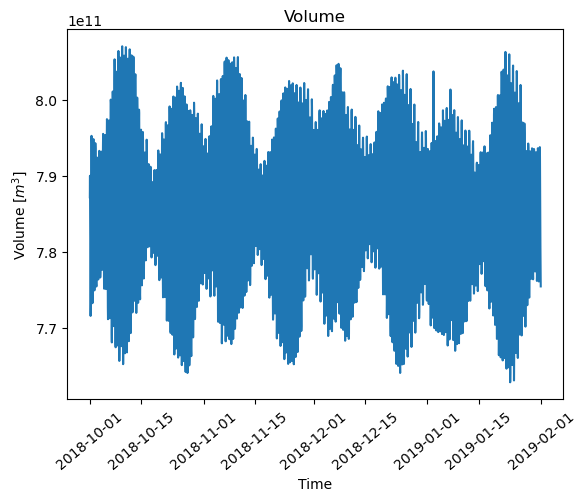
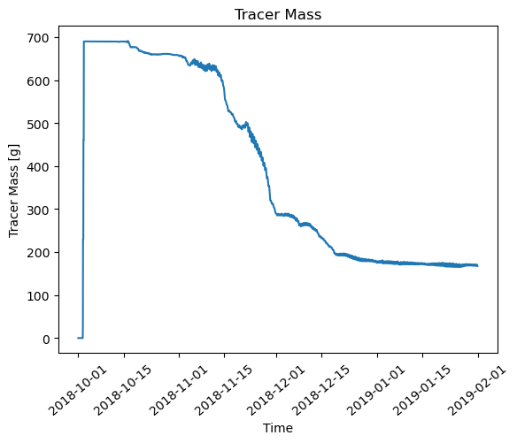
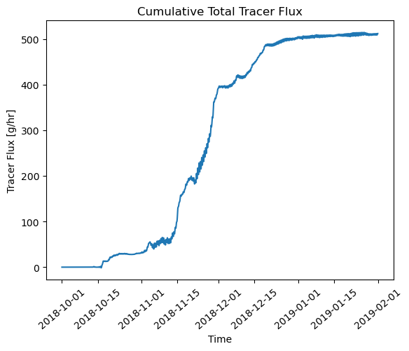
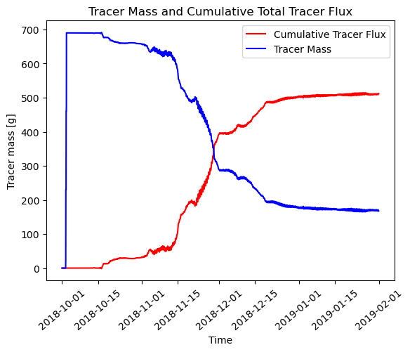
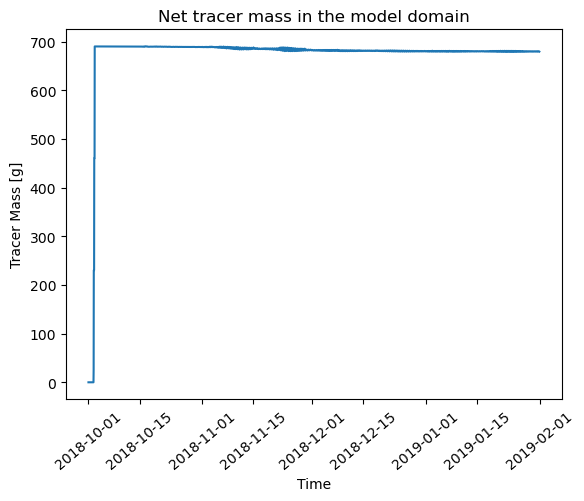
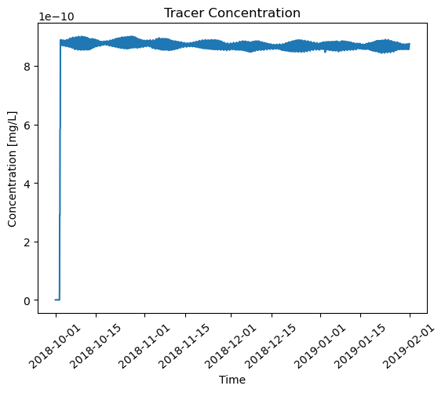
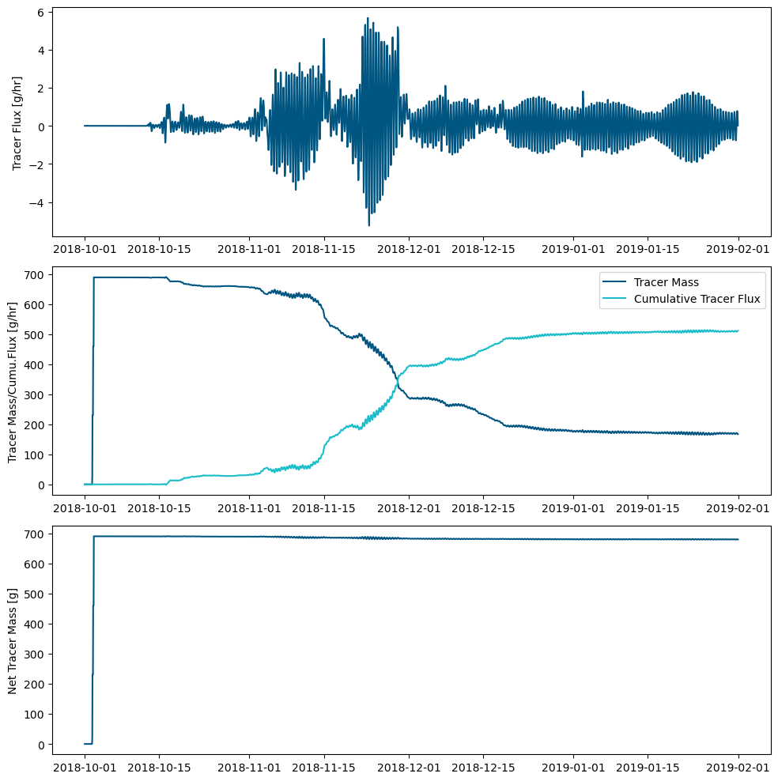
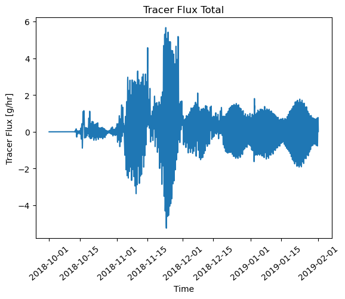
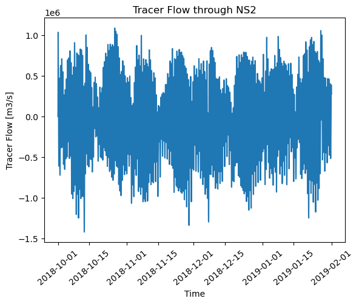

# Mass Balance Analysis: Analysing Tracer Mass and Fluxes in TUFLOW FV Outputs

**This notebook provides a guide on how to import and preprocess the necessary data files, create data frames, and perform calculations to derive useful metrics for tracer mass and fluxes.**

## Import Libraries


```python
import matplotlib.pyplot as plt
import pandas as pd
import datetime as dt
```

## Read tuflowfv tracer mass output csv  
**'TRACE_1_MASS [units]'** represents the mass of tracer 1 in the whole model domain.   
Units are *concentration units x m<sup>3</sup>*.  
We have used the conconetration units as **ng/L** (nanograms per litre) for this exercise.


```python
mass_bal = r"K:\scratchers\MASS.csv"
df_mass = pd.read_csv(mass_bal, delimiter=',', usecols=['TIME', 'VOLUME [m^3]', 'TRACE_1_MASS [units]'])

# head of mass_bal dataframe
print(df_mass.head())
```

                      TIME  VOLUME [m^3]  TRACE_1_MASS [units]
    0  01/10/2018 00:00:00  7.871680e+11                   0.0
    1  01/10/2018 01:00:10  7.899846e+11                   0.0
    2  01/10/2018 02:00:08  7.845009e+11                   0.0
    3  01/10/2018 03:00:03  7.776127e+11                   0.0
    4  01/10/2018 04:00:14  7.729145e+11                   0.0
    

## Create additional columns for trcaer mass dataframe
Two new columns are added to the dataframe df_mass.  
'TRACE_1_MASS [g]' is created deviding TRACE_1_MASS [units] by 10<sup>6</sup>.    
'TRACE_1_CONC' is the concentration of the TRACE_1 which has units of **g/m<sup>3</sup> or mg/L**


```python
df_mass['TRACE_1_MASS [g]'] = df_mass['TRACE_1_MASS [units]'] / 1000000
df_mass['TRACE_1_CONC'] = df_mass['TRACE_1_MASS [g]'] / df_mass['VOLUME [m^3]']
print(df_mass.head())
```

                      TIME  VOLUME [m^3]  TRACE_1_MASS [units]  TRACE_1_MASS [g]  \
    0  01/10/2018 00:00:00  7.871680e+11                   0.0               0.0   
    1  01/10/2018 01:00:10  7.899846e+11                   0.0               0.0   
    2  01/10/2018 02:00:08  7.845009e+11                   0.0               0.0   
    3  01/10/2018 03:00:03  7.776127e+11                   0.0               0.0   
    4  01/10/2018 04:00:14  7.729145e+11                   0.0               0.0   
    
       TRACE_1_CONC  
    0           0.0  
    1           0.0  
    2           0.0  
    3           0.0  
    4           0.0  
    

## Read tuflowfv tracer flux output csv
In this exercise fluxes through two  nodestings are considered.  
For ex; *'NS1_TRACE_1_FLUX' and 'NS2_TRACE_1_FLUX'* represent the flux through the nodestring 1 and 2 respectively.  
Flux Units are *m<sup>3</sup> s<sup>-1</sup>*.  


```python
# read tuflowfv flux output csv
flux= r"K:\scratchers\FLUX.csv"
df_flux = pd.read_csv(flux, delimiter=',', usecols=['TIME', 'NS1_FLOW [m^3 s^-1]', 'NS2_FLOW [m^3 s^-1]', 'NS1_TRACE_1_FLUX [units m^3 s^-1]', 'NS2_TRACE_1_FLUX [units m^3 s^-1]'])
# head of flux dataframe
print(df_flux.head())
```

                      TIME  NS1_FLOW [m^3 s^-1]  \
    0  01/10/2018 00:00:00                  0.0   
    1  01/10/2018 01:00:10            -134333.7   
    2  01/10/2018 02:00:08             799288.8   
    3  01/10/2018 03:00:03             513126.3   
    4  01/10/2018 04:00:14             153102.7   
    
       NS1_TRACE_1_FLUX [units m^3 s^-1]  NS2_FLOW [m^3 s^-1]  \
    0                                0.0                 0.00   
    1                                0.0             94314.29   
    2                                0.0           1035166.00   
    3                                0.0            770842.90   
    4                                0.0            607895.00   
    
       NS2_TRACE_1_FLUX [units m^3 s^-1]  
    0                                0.0  
    1                                0.0  
    2                                0.0  
    3                                0.0  
    4                                0.0  
    

## Create additional columns for trcaer flux dataframe

Three new columns are added to the dataframe df_flux.  
'TRACE_1_Tot_Flux is created by adding 'NS1_TRACE_1_FLUX' and 'NS2_TRACE_1_FLUX' together.  
'TRACE_1_Tot_Flux [g/hr]' is created with unit converstions of 'TRACE_1_Tot_Flux [units/s]'.  
'TRACE_1_Tot_Flux_cumu [g/hr]' is created with cumulative values 'TRACE_1_Tot_Flux [g/hr]'.  


```python
#Add to fluxes at two nodestrings NS1 and NS2
df_flux['TRACE_1_Tot_Flux [units/s]'] = df_flux['NS1_TRACE_1_FLUX [units m^3 s^-1]'] + df_flux['NS2_TRACE_1_FLUX [units m^3 s^-1]']

#convert flux units from ng/L*m3/s to g/hr
df_flux['TRACE_1_Tot_Flux [g/hr]'] = df_flux['TRACE_1_Tot_Flux [units/s]'] / 1000000 *3600
df_flux['TRACE_1_Tot_Flux_cumu [g/hr]'] = df_flux['TRACE_1_Tot_Flux [g/hr]'].cumsum()
print(df_flux.head())

```

                      TIME  NS1_FLOW [m^3 s^-1]  \
    0  01/10/2018 00:00:00                  0.0   
    1  01/10/2018 01:00:10            -134333.7   
    2  01/10/2018 02:00:08             799288.8   
    3  01/10/2018 03:00:03             513126.3   
    4  01/10/2018 04:00:14             153102.7   
    
       NS1_TRACE_1_FLUX [units m^3 s^-1]  NS2_FLOW [m^3 s^-1]  \
    0                                0.0                 0.00   
    1                                0.0             94314.29   
    2                                0.0           1035166.00   
    3                                0.0            770842.90   
    4                                0.0            607895.00   
    
       NS2_TRACE_1_FLUX [units m^3 s^-1]  TRACE_1_Tot_Flux [units/s]  \
    0                                0.0                         0.0   
    1                                0.0                         0.0   
    2                                0.0                         0.0   
    3                                0.0                         0.0   
    4                                0.0                         0.0   
    
       TRACE_1_Tot_Flux [g/hr]  TRACE_1_Tot_Flux_cumu [g/hr]  
    0                      0.0                           0.0  
    1                      0.0                           0.0  
    2                      0.0                           0.0  
    3                      0.0                           0.0  
    4                      0.0                           0.0  
    

### Slice the dataframe based on start nd end times


```python
#add start and end time to slice them easier
start_time = '01/10/2018 00:00:00'
end_time = '01/02/2019 00:00:00'

# Convert 'TIME' column to datetime format
df_mass['TIME'] = pd.to_datetime(df_mass['TIME'], dayfirst=True)
df_flux['TIME'] = pd.to_datetime(df_flux['TIME'], dayfirst=True)

# Convert start and end times to datetime format
start_time = pd.to_datetime(start_time, dayfirst=True)
end_time = pd.to_datetime(end_time, dayfirst=True)

# Slice the dataframe based on the start and end times
df_slicemass = df_mass[(df_mass['TIME'] >= start_time) & (df_mass['TIME'] <= end_time)]
df_sliceflux = df_flux[(df_flux['TIME'] >= start_time) & (df_flux['TIME'] <= end_time)]

#head rows
#print(df_slicemass.head())
#print(df_sliceflux.head())

```

### Merge the two data frames based on 'TIME'


```python
merged_df = pd.merge(df_slicemass, df_sliceflux, on='TIME')
#print(merged_df.head())

```

### Add new column for the net mass and net concnetration.    
Net concnetration is a hypothetical variable.  


```python
merged_df['TRACE_1_net_mass [g]'] = merged_df['TRACE_1_MASS [g]'] + merged_df['TRACE_1_Tot_Flux_cumu [g/hr]']
merged_df['TRACE_1_NET_CONC'] = merged_df['TRACE_1_net_mass [g]'] / merged_df['VOLUME [m^3]']
print(merged_df.head())
```

                     TIME  VOLUME [m^3]  TRACE_1_MASS [units]  TRACE_1_MASS [g]  \
    0 2018-10-01 00:00:00  7.871680e+11                   0.0               0.0   
    1 2018-10-01 01:00:10  7.899846e+11                   0.0               0.0   
    2 2018-10-01 02:00:08  7.845009e+11                   0.0               0.0   
    3 2018-10-01 03:00:03  7.776127e+11                   0.0               0.0   
    4 2018-10-01 04:00:14  7.729145e+11                   0.0               0.0   
    
       TRACE_1_CONC  NS1_FLOW [m^3 s^-1]  NS1_TRACE_1_FLUX [units m^3 s^-1]  \
    0           0.0                  0.0                                0.0   
    1           0.0            -134333.7                                0.0   
    2           0.0             799288.8                                0.0   
    3           0.0             513126.3                                0.0   
    4           0.0             153102.7                                0.0   
    
       NS2_FLOW [m^3 s^-1]  NS2_TRACE_1_FLUX [units m^3 s^-1]  \
    0                 0.00                                0.0   
    1             94314.29                                0.0   
    2           1035166.00                                0.0   
    3            770842.90                                0.0   
    4            607895.00                                0.0   
    
       TRACE_1_Tot_Flux [units/s]  TRACE_1_Tot_Flux [g/hr]  \
    0                         0.0                      0.0   
    1                         0.0                      0.0   
    2                         0.0                      0.0   
    3                         0.0                      0.0   
    4                         0.0                      0.0   
    
       TRACE_1_Tot_Flux_cumu [g/hr]  TRACE_1_net_mass [g]  TRACE_1_NET_CONC  
    0                           0.0                   0.0               0.0  
    1                           0.0                   0.0               0.0  
    2                           0.0                   0.0               0.0  
    3                           0.0                   0.0               0.0  
    4                           0.0                   0.0               0.0  
    

### A quick check of cumulative flux


```python
#Calculate tracer flux mean
df_mean = merged_df['TRACE_1_Tot_Flux [g/hr]'].mean()
print('Mean flux:', df_mean)
tot_flux = df_mean * 24 *30 *4
print('Total flux:', tot_flux)

#Get the sum
flux_sum = merged_df['TRACE_1_Tot_Flux [g/hr]'].sum()
print('Total flux:', flux_sum)
```

    Mean flux: 0.17341253262214235
    Total flux: 499.42809395177
    Total flux: 511.91379630056423
    

# Plot

## Volume


```python
# Plot timeseries for 'VOLUME [m^3]'
plt.plot(merged_df['TIME'], merged_df['VOLUME [m^3]'])
plt.title('Volume')
plt.xlabel('Time')
plt.ylabel('Volume [$m^3$]')
#plt.ylim((7, 9))
plt.xticks(rotation=40)
plt.show()
```


    

    


## Tracer Mass   
The reason for missing treacer mass is that it leaves the model domain boundary as tracer fluxes.


```python
# Plot timeseries for 'TRACE_1_MASS [g]'
plt.plot(merged_df['TIME'], merged_df['TRACE_1_MASS [g]'])
plt.title('Tracer Mass')
plt.xlabel('Time')
plt.ylabel('Tracer Mass [g]')
plt.xticks(rotation=40)
plt.show()
```


    

    


### Tracer Fluxes


```python
#Plot timeseries for 'TRACE_1_Tot_Flux [g/hr]' at NS2
plt.plot(merged_df['TIME'], merged_df['TRACE_1_Tot_Flux [g/hr]'])
plt.title('Tracer Flux Total')
plt.xlabel('Time')
plt.ylabel('Tracer Flux [g/hr]')
plt.xticks(rotation=40)
plt.show()
```


    

    


Total cumulative tracer flux should equal to the missing tracer mass. 


```python
#Plot timeseries for 'Cumulative Total Tracer Flux
plt.plot(merged_df['TIME'], merged_df['TRACE_1_Tot_Flux_cumu [g/hr]'])
plt.title('Cumulative Total Tracer Flux')
plt.xlabel('Time')
plt.ylabel('Tracer Flux [g/hr]')
plt.xticks(rotation=40)
plt.show()
```


    

    


## Cumulative tracer fllux vs tracer mass


```python
# Plot timeseries for 'Cumulative Total Tracer Flux'
plt.plot(merged_df['TIME'], merged_df['TRACE_1_Tot_Flux_cumu [g/hr]'], color='red', label='Cumulative Tracer Flux')

# Plot timeseries for 'TRACE_1_MASS [g]'
plt.plot(merged_df['TIME'], merged_df['TRACE_1_MASS [g]'], color='blue', label='Tracer Mass')

plt.title('Tracer Mass and Cumulative Total Tracer Flux')
plt.xlabel('Time')
plt.ylabel('Tracer mass [g]')
plt.xticks(rotation=40)
plt.legend()
plt.show()

```


    

    


## Net tracer mass


```python
# Add tracer mass and cumulative flux together
# Plot timeseries for 'TRACE_1_NetMASS [g]'
plt.plot(merged_df['TIME'], merged_df['TRACE_1_net_mass [g]'])
plt.title('Net tracer mass in the model domain')
plt.xlabel('Time')
plt.ylabel('Tracer Mass [g]')
plt.xticks(rotation=40)
plt.show()
```


    

    


## Check Mass Balance Error


```python
# Find the total mass of tracer present in the model domain at the end of simulation
final_tracer_mass = merged_df['TRACE_1_net_mass [g]'].iloc[-1]

# Set the time of mass added (considering only the minute part of the time)
mass_added_time = pd.to_datetime('02/10/2018 17:00', format='%d/%m/%Y %H:%M')
```


```python
# Find the mass of tracer added
df_time = merged_df.copy()
df_time['TIME'] = pd.to_datetime(df_time['TIME'], format='%d/%m/%Y %H:%M:%S')
mass_added = df_time.loc[df_time['TIME'].dt.strftime('%d/%m/%Y %H:%M') == mass_added_time.strftime('%d/%m/%Y %H:%M'), 'TRACE_1_net_mass [g]'].iloc[0]
# Calculate the mass balance error as a percentage
mass_balance_error = ((final_tracer_mass - mass_added) / mass_added) * 100

print('Mass balance error: {:.2f}%'.format(mass_balance_error))
```

    Mass balance error: -1.54%
    

## Concentration plots
#### Concentration based on mass excluding fluxes at the boundary


```python
# Plot timeseries for 'Tracer Concentration'
plt.plot(merged_df['TIME'], merged_df['TRACE_1_CONC'])
plt.title('Tracer Concentration')
plt.xlabel('Time')
plt.ylabel('Concentration [mg/L]')
#plt.ylim((7.7e-10, 7.8e-10))
plt.xticks(rotation=40)
plt.show()
```


    

    


### Concentration based on net mass including fluxes at the boundary¶


```python
# Plot timeseries for 'Tracer Concentration'
plt.plot(merged_df['TIME'], merged_df['TRACE_1_NET_CONC'])
plt.title('Tracer Concentration')
plt.xlabel('Time')
plt.ylabel('Concentration [mg/L]')
#plt.ylim((7.7e-10, 7.8e-10))
plt.xticks(rotation=40)
plt.show()
```


    

    


## Create figures
### Tracer Mass excluding fluxes


```python
# Create a figure with three subplots
fig, axs = plt.subplots(nrows=3, ncols=1, figsize=(10, 10))

# Plot timeseries for 'VOLUME [m^3]'
axs[0].plot(merged_df['TIME'], merged_df['VOLUME [m^3]'],color='#005581')
#axs[0].set_title('Volume')
#axs[0].set_xlabel('Time')
axs[0].set_ylabel('Volume [$m^3$]')
axs[0].tick_params(axis='x', rotation=0)

# Plot timeseries for 'TRACE_1_MASS [g]'
axs[1].plot(merged_df['TIME'], merged_df['TRACE_1_MASS [g]'],color='#005581')
#axs[1].set_title('Tracer Mass')
#axs[1].set_xlabel('Time')
axs[1].set_ylabel('Tracer Mass [g]')
axs[1].tick_params(axis='x', rotation=0)

# Plot timeseries for 'Tracer Concentration'
axs[2].plot(merged_df['TIME'], merged_df['TRACE_1_CONC'],color='#005581')
#axs[2].set_title('Tracer Concentration')
#axs[2].set_xlabel('Time')
axs[2].set_ylabel('Concentration [mg/L]')
axs[2].tick_params(axis='x', rotation=0)

# Adjust the layout of the subplots
plt.tight_layout()

# Show the figure
plt.show()
fig.savefig('figures/SiteA_Mass_Balance_highdif1.png',dpi=300)
#fig.savefig('my_figure.png', dpi=300, bbox_inches='tight')

```


    

    


    ---------------------------------------------------------------------------

    FileNotFoundError                         Traceback (most recent call last)

    Cell In[39], line 30
         28 # Show the figure
         29 plt.show()
    ---> 30 fig.savefig('figures/SiteA_Mass_Balance_highdif1.png',dpi=300)
         31 #fig.savefig('my_figure.png', dpi=300, bbox_inches='tight')
    

    File ~\.conda\envs\coastal\lib\site-packages\matplotlib\figure.py:3285, in Figure.savefig(self, fname, transparent, **kwargs)
       3281     for ax in self.axes:
       3282         stack.enter_context(
       3283             ax.patch._cm_set(facecolor='none', edgecolor='none'))
    -> 3285 self.canvas.print_figure(fname, **kwargs)
    

    File ~\.conda\envs\coastal\lib\site-packages\matplotlib\backend_bases.py:2338, in FigureCanvasBase.print_figure(self, filename, dpi, facecolor, edgecolor, orientation, format, bbox_inches, pad_inches, bbox_extra_artists, backend, **kwargs)
       2334 try:
       2335     # _get_renderer may change the figure dpi (as vector formats
       2336     # force the figure dpi to 72), so we need to set it again here.
       2337     with cbook._setattr_cm(self.figure, dpi=dpi):
    -> 2338         result = print_method(
       2339             filename,
       2340             facecolor=facecolor,
       2341             edgecolor=edgecolor,
       2342             orientation=orientation,
       2343             bbox_inches_restore=_bbox_inches_restore,
       2344             **kwargs)
       2345 finally:
       2346     if bbox_inches and restore_bbox:
    

    File ~\.conda\envs\coastal\lib\site-packages\matplotlib\backend_bases.py:2204, in FigureCanvasBase._switch_canvas_and_return_print_method.<locals>.<lambda>(*args, **kwargs)
       2200     optional_kws = {  # Passed by print_figure for other renderers.
       2201         "dpi", "facecolor", "edgecolor", "orientation",
       2202         "bbox_inches_restore"}
       2203     skip = optional_kws - {*inspect.signature(meth).parameters}
    -> 2204     print_method = functools.wraps(meth)(lambda *args, **kwargs: meth(
       2205         *args, **{k: v for k, v in kwargs.items() if k not in skip}))
       2206 else:  # Let third-parties do as they see fit.
       2207     print_method = meth
    

    File ~\.conda\envs\coastal\lib\site-packages\matplotlib\_api\deprecation.py:410, in delete_parameter.<locals>.wrapper(*inner_args, **inner_kwargs)
        400     deprecation_addendum = (
        401         f"If any parameter follows {name!r}, they should be passed as "
        402         f"keyword, not positionally.")
        403     warn_deprecated(
        404         since,
        405         name=repr(name),
       (...)
        408                  else deprecation_addendum,
        409         **kwargs)
    --> 410 return func(*inner_args, **inner_kwargs)
    

    File ~\.conda\envs\coastal\lib\site-packages\matplotlib\backends\backend_agg.py:517, in FigureCanvasAgg.print_png(self, filename_or_obj, metadata, pil_kwargs, *args)
        468 @_api.delete_parameter("3.5", "args")
        469 def print_png(self, filename_or_obj, *args,
        470               metadata=None, pil_kwargs=None):
        471     """
        472     Write the figure to a PNG file.
        473 
       (...)
        515         *metadata*, including the default 'Software' key.
        516     """
    --> 517     self._print_pil(filename_or_obj, "png", pil_kwargs, metadata)
    

    File ~\.conda\envs\coastal\lib\site-packages\matplotlib\backends\backend_agg.py:464, in FigureCanvasAgg._print_pil(self, filename_or_obj, fmt, pil_kwargs, metadata)
        459 """
        460 Draw the canvas, then save it using `.image.imsave` (to which
        461 *pil_kwargs* and *metadata* are forwarded).
        462 """
        463 FigureCanvasAgg.draw(self)
    --> 464 mpl.image.imsave(
        465     filename_or_obj, self.buffer_rgba(), format=fmt, origin="upper",
        466     dpi=self.figure.dpi, metadata=metadata, pil_kwargs=pil_kwargs)
    

    File ~\.conda\envs\coastal\lib\site-packages\matplotlib\image.py:1667, in imsave(fname, arr, vmin, vmax, cmap, format, origin, dpi, metadata, pil_kwargs)
       1665 pil_kwargs.setdefault("format", format)
       1666 pil_kwargs.setdefault("dpi", (dpi, dpi))
    -> 1667 image.save(fname, **pil_kwargs)
    

    File ~\.conda\envs\coastal\lib\site-packages\PIL\Image.py:2428, in Image.save(self, fp, format, **params)
       2426         fp = builtins.open(filename, "r+b")
       2427     else:
    -> 2428         fp = builtins.open(filename, "w+b")
       2430 try:
       2431     save_handler(self, fp, filename)
    

    FileNotFoundError: [Errno 2] No such file or directory: 'figures/SiteA_Mass_Balance_highdif1.png'


## Net tracer mass including fluxes at the boundary


```python
# Create a figure with three subplots
fig, axs = plt.subplots(nrows=3, ncols=1, figsize=(10, 10))

# Plot timeseries for 'VOLUME [m^3]'
axs[0].plot(merged_df['TIME'], merged_df['TRACE_1_Tot_Flux [g/hr]'],color='#005581', label='Total Tracer Flux')
#axs[0].plot(merged_df['TIME'], merged_df['TRACE_1_Tot_Flux_cumu [g/hr]'], color='#1ABDC9', label='Cumulative Tracer Flux')
#axs[0].set_title('Volume')
#axs[0].set_xlabel('Time')
axs[0].set_ylabel('Tracer Flux [g/hr]')
axs[0].tick_params(axis='x', rotation=0)

# Plot timeseries for 'TRACE_1_MASS [g]'
axs[1].plot(merged_df['TIME'], merged_df['TRACE_1_MASS [g]'],color='#005581', label='Tracer Mass')
axs[1].plot(merged_df['TIME'], merged_df['TRACE_1_Tot_Flux_cumu [g/hr]'], color='#1ABDC9', label='Cumulative Tracer Flux')

#axs[1].set_title('Tracer Mass')
#axs[1].set_xlabel('Time')
axs[1].legend(loc='upper right')
axs[1].set_ylabel('Tracer Mass/Cumu.Flux [g/hr]')
axs[1].tick_params(axis='x', rotation=0)

# Plot timeseries for 'Tracer Concentration'
axs[2].plot(merged_df['TIME'], merged_df['TRACE_1_net_mass [g]'],color='#005581')
#axs[2].set_title('Tracer Concentration')
#axs[2].set_xlabel('Time')
axs[2].set_ylabel('Net Tracer Mass [g]')
axs[2].tick_params(axis='x', rotation=0)

# Adjust the layout of the subplots
plt.tight_layout()

# Show the figure
plt.show()
fig.savefig('figures/SiteA_Mass_Balance_highdif2.png',dpi=300)
#fig.savefig('my_figure.png', dpi=300, bbox_inches='tight')

```


    

    


    ---------------------------------------------------------------------------

    FileNotFoundError                         Traceback (most recent call last)

    Cell In[40], line 34
         32 # Show the figure
         33 plt.show()
    ---> 34 fig.savefig('figures/SiteA_Mass_Balance_highdif2.png',dpi=300)
         35 #fig.savefig('my_figure.png', dpi=300, bbox_inches='tight')
    

    File ~\.conda\envs\coastal\lib\site-packages\matplotlib\figure.py:3285, in Figure.savefig(self, fname, transparent, **kwargs)
       3281     for ax in self.axes:
       3282         stack.enter_context(
       3283             ax.patch._cm_set(facecolor='none', edgecolor='none'))
    -> 3285 self.canvas.print_figure(fname, **kwargs)
    

    File ~\.conda\envs\coastal\lib\site-packages\matplotlib\backend_bases.py:2338, in FigureCanvasBase.print_figure(self, filename, dpi, facecolor, edgecolor, orientation, format, bbox_inches, pad_inches, bbox_extra_artists, backend, **kwargs)
       2334 try:
       2335     # _get_renderer may change the figure dpi (as vector formats
       2336     # force the figure dpi to 72), so we need to set it again here.
       2337     with cbook._setattr_cm(self.figure, dpi=dpi):
    -> 2338         result = print_method(
       2339             filename,
       2340             facecolor=facecolor,
       2341             edgecolor=edgecolor,
       2342             orientation=orientation,
       2343             bbox_inches_restore=_bbox_inches_restore,
       2344             **kwargs)
       2345 finally:
       2346     if bbox_inches and restore_bbox:
    

    File ~\.conda\envs\coastal\lib\site-packages\matplotlib\backend_bases.py:2204, in FigureCanvasBase._switch_canvas_and_return_print_method.<locals>.<lambda>(*args, **kwargs)
       2200     optional_kws = {  # Passed by print_figure for other renderers.
       2201         "dpi", "facecolor", "edgecolor", "orientation",
       2202         "bbox_inches_restore"}
       2203     skip = optional_kws - {*inspect.signature(meth).parameters}
    -> 2204     print_method = functools.wraps(meth)(lambda *args, **kwargs: meth(
       2205         *args, **{k: v for k, v in kwargs.items() if k not in skip}))
       2206 else:  # Let third-parties do as they see fit.
       2207     print_method = meth
    

    File ~\.conda\envs\coastal\lib\site-packages\matplotlib\_api\deprecation.py:410, in delete_parameter.<locals>.wrapper(*inner_args, **inner_kwargs)
        400     deprecation_addendum = (
        401         f"If any parameter follows {name!r}, they should be passed as "
        402         f"keyword, not positionally.")
        403     warn_deprecated(
        404         since,
        405         name=repr(name),
       (...)
        408                  else deprecation_addendum,
        409         **kwargs)
    --> 410 return func(*inner_args, **inner_kwargs)
    

    File ~\.conda\envs\coastal\lib\site-packages\matplotlib\backends\backend_agg.py:517, in FigureCanvasAgg.print_png(self, filename_or_obj, metadata, pil_kwargs, *args)
        468 @_api.delete_parameter("3.5", "args")
        469 def print_png(self, filename_or_obj, *args,
        470               metadata=None, pil_kwargs=None):
        471     """
        472     Write the figure to a PNG file.
        473 
       (...)
        515         *metadata*, including the default 'Software' key.
        516     """
    --> 517     self._print_pil(filename_or_obj, "png", pil_kwargs, metadata)
    

    File ~\.conda\envs\coastal\lib\site-packages\matplotlib\backends\backend_agg.py:464, in FigureCanvasAgg._print_pil(self, filename_or_obj, fmt, pil_kwargs, metadata)
        459 """
        460 Draw the canvas, then save it using `.image.imsave` (to which
        461 *pil_kwargs* and *metadata* are forwarded).
        462 """
        463 FigureCanvasAgg.draw(self)
    --> 464 mpl.image.imsave(
        465     filename_or_obj, self.buffer_rgba(), format=fmt, origin="upper",
        466     dpi=self.figure.dpi, metadata=metadata, pil_kwargs=pil_kwargs)
    

    File ~\.conda\envs\coastal\lib\site-packages\matplotlib\image.py:1667, in imsave(fname, arr, vmin, vmax, cmap, format, origin, dpi, metadata, pil_kwargs)
       1665 pil_kwargs.setdefault("format", format)
       1666 pil_kwargs.setdefault("dpi", (dpi, dpi))
    -> 1667 image.save(fname, **pil_kwargs)
    

    File ~\.conda\envs\coastal\lib\site-packages\PIL\Image.py:2428, in Image.save(self, fp, format, **params)
       2426         fp = builtins.open(filename, "r+b")
       2427     else:
    -> 2428         fp = builtins.open(filename, "w+b")
       2430 try:
       2431     save_handler(self, fp, filename)
    

    FileNotFoundError: [Errno 2] No such file or directory: 'figures/SiteA_Mass_Balance_highdif2.png'


```python

```


```python

```


```python

```


```python

```


```python

```

### Other plots


```python
#Plot timeseries for 'TRACE_1_Tot_Flux [g/hr]' at NS1
plt.plot(merged_df['TIME'], merged_df['NS1_TRACE_1_FLUX [units m^3 s^-1]'])
plt.title('Tracer Flux NS1')
plt.xlabel('Time')
plt.ylabel('Tracer Flux [units/s]')
plt.xticks(rotation=40)
plt.show()
```


    

    


```python

```


```python
#Plot timeseries for 'TRACE_1_Tot_Flux [g/hr]' at NS2
#plt.plot(df_sliceflux['TIME'], df_sliceflux['TRACE_1_Tot_Flux [g/hr]'])
plt.plot(merged_df['TIME'], merged_df['NS2_TRACE_1_FLUX [units m^3 s^-1]'])
plt.title('Tracer Flux NS2')
plt.xlabel('Time')
plt.ylabel('Tracer Flux [units/s]')
plt.xticks(rotation=40)
plt.show()
```


    

    


```python
#Plot timeseries for 'NS1_FLOW [m^3 s^-1]' at NS1
plt.plot(merged_df['TIME'], merged_df['NS1_FLOW [m^3 s^-1]'])
plt.title('Tracer Flow through NS1')
plt.xlabel('Time')
plt.ylabel('Tracer Flow [m3/s]')
plt.xticks(rotation=40)
plt.show()
```


    

    


```python
#Plot timeseries for 'NS2_FLOW [m^3 s^-1]' at NS1
plt.plot(merged_df['TIME'], merged_df['NS2_FLOW [m^3 s^-1]'])
plt.title('Tracer Flow through NS2')
plt.xlabel('Time')
plt.ylabel('Tracer Flow [m3/s]')
plt.xticks(rotation=40)
plt.show()
```


    

    


```python
#Plot timeseries for 'TRACE_1_Tot_Flux [g/hr]' at NS2
plt.plot(merged_df['TIME'], merged_df['TRACE_1_Tot_Flux [g/hr]'])
plt.title('Tracer Flux Total')
plt.xlabel('Time')
plt.ylabel('Tracer Flux [g/hr]')
plt.xticks(rotation=40)
plt.show()
```


    

    


Concentration based on mass excluding fluxes at the boundary


```python

```


```python

```


```python

```


```python

```


```python

```
